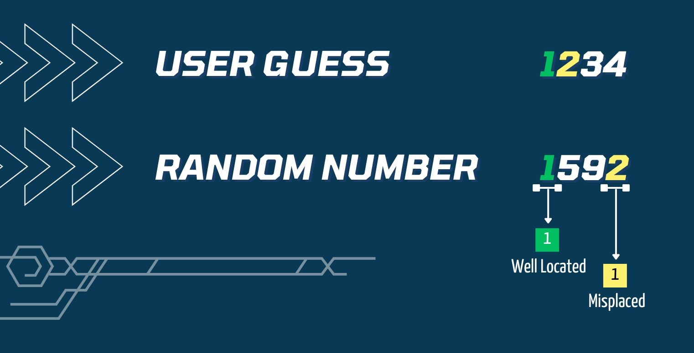

<div align="center"> 
    
</div>

## Try to guess the 4-digit number.

This documentation provides an overview of the Perfect Four game code, explaining its functions and how the game operates.

# Installation

1. Clone the repository to your local machine.

    ```javascript
    git clone https://github.com/Pilag6/project-perfectFourGame.git
    ```

2. Navigate to the project directory.

    ```javascript
    cd project-perfectFourGame/
    ```

3. Install the dependencies.

    ```javascript
    npm install
    ```

4. Run the game.

    ```javascript
    node play
    ```

# Rules and Instructions

Welcome to the Perfect Four game! This game challenges you to guess a randomly generated 4-digit number with unique digits. Here are the rules and instructions:

1. **Objective:** Guess the correct 4-digit number within 8 attempts.

2. **Game Start:**

    - The game will generate a random 4-digit number with unique digits. For example: 2574
    - You have 8 attempts to guess this number.

3. **Guessing Rules:**

    - Enter a 4-digit number when prompted.
    - Digits must be different within your guess.
    - _Example:_

    ```
    Valid guess - 1369;
    Invalid guess - 1123.
    ```

4. **Feedback:**

    - After each guess, you will receive feedback on the correctness of your digits.
    - "Well Located" indicates the number of digits correctly positioned and valued.
    - "Misplaced" indicates the number of digits present but in the wrong position.
    - _Example:_

    ```
    If your guess is 1275 and the random number is 1574,
    feedback might be "Well Located: 2 | Misplaced: 1."
    ```

    <div align="center"> 
        
    </div>

5. **Repeated Digits:**

    - If you enter a number with repeated digits, you'll be prompted to enter a different one.
    - Repeated digit entries will result in a deduction of attempts.
    - _Example:_

    ```
    If your guess is 1123,
    you'll be prompted to enter a different number
    because you are repeating the number "1".
    ```

    - The same will happen if you enter a number with more or less than 4 digits.
    - More or less than 4 digits will result in a deduction of attempts.
    - _Example:_

    ```
    If your guess is 123,
    you'll be prompted to enter a different number
    because you are missing a digit.

    If your guess is 12345,
    you'll be prompted to enter a different number
    because you have an extra digit.
    ```

6. **Winning:**

    - If you correctly guess all 4 digits in their correct positions, you win!
    - The game will congratulate you on your victory.

7. **Losing:**

    - You have 8 attempts. If you don't guess correctly within these attempts, you lose.
    - The correct number will be revealed upon losing.

8. **Game Display:**

    - The game will display your current guess, well-located and misplaced digits, and the remaining number of guesses after each attempt.
    - _Example:_ After a guess, the display might be:

    ```
     1. Your guess: 1369
     2. Well Located: 1 | Misplaced: 2
     3. Guesses left: 6
    ```

    - The game will also display the correct number upon losing.

Good luck and enjoy the Perfect Four game!

---

---

---

---

# Code Overview

## 1. `checkGuess` Function


This function takes two parameters, `randomNumber` and `userGuess`, and compares them to determine how well the user's guess matches the randomly generated number.

-   `randomNumber`: A randomly generated 4-digit number with unique digits.
-   `userGuess`: The user's input, a 4-digit number.

### Function Logic

1. **Convert Numbers to Arrays:**

-   `randomNumberDigits`: Convert the randomNumber to a string and then split it into an array of individual digits.
-   `userGuessDigits`: Convert the userGuess to a string and then split it into an array of individual digits.

2. **Initialize Counters:**

-   `wellLocated`: Counter for digits that are correctly located in both position and value.
-   `misplaced`: Counter for digits that are present in the user's guess but located in the wrong position compared to the random number.

3. **Check Well-Located Digits:**

-   Iterate through each digit of the guess using a for loop.
-   If the digit at the current position in `randomNumberDigits` is equal to the digit at the same position in `userGuessDigits`, increment the `wellLocated` counter.

4. **Check Misplaced Digits:**

If a digit in `userGuessDigits` is not well-located (checked in the previous step) but exists in `randomNumberDigits`, increment the `misplaced` counter.

5. **Return Results:**

Return an object containing the counts of well-located and misplaced digits: `{ wellLocated, misplaced }`.

Example

```javascript
const randomNumExample = 7021;
const userNumExample = 7142;

const result = checkGuess(randomNumExample, userNumExample);
console.log(result); // { wellLocated: 1, misplaced: 2 }
```

In this example, the function compares the digits at each position in the `randomNumber` and `userGuess`. One digit is well-located (digit 7), and two digits are misplaced (digits 1 and 2). The result object reflects these counts.

## 2. `generateRandomNumber` Function


This function is responsible for generating a random 4-digit number with unique digits, which serves as the target number for the player to guess.

### Function Logic

1. **Random Number Generation:**

-   The function starts by initializing `randomNumber` with a random number between 0 and 1, obtained using `Math.random()`.

```javascript
let randomNumber = Math.floor(Math.random() * 10000);
```
-   The multiplication by 10000 ensures that the generated number is within the 4-digit range.

2. **Unique Digits Check:**

-   The function enters a `while` loop to ensure that the generated number has unique digits.

```javascript
while (randomNumber < 1000 || hasRepeatedDigits(randomNumber)) {
    randomNumber = Math.floor(Math.random() * 10000);
}
```

-   The loop continues generating new numbers until one is found that is greater than or equal to 1000 and has no repeated digits.
-   The generated number is checked to ensure it is greater than or equal to 1000 and has no repeated digits using the `hasRepeatedDigits` function.

Example:

```javascript
const randomNum = generateRandomNumber();
console.log(randomNum); // 2574
```

In this example, the function generates a random number and checks it for uniqueness. The number 2574 is returned as it is greater than or equal to 1000 and has no repeated digits.

## 3. `hasRepeatedDigits` Function


This function is designed to check whether a given number has repeated digits. It's a crucial part of the Perfect Four game as having repeated digits in a guess is against the game rules. Here's a breakdown of how the function works:

Explanation:

1. **Conversion to String:**

`const digits = String(number).split("");`

-   The function starts by converting the given number to a string and then splitting it into an array of individual digits.

2. **Filtering Unique Digits:**

`const uniqueDigits = digits.filter((digit, index) => { return digits.indexOf(digit) === index; });`

-   The function uses the `filter` method to create an array (`uniqueDigits`) containing only the unique digits. The filter function checks if the index of the current digit is equal to its first occurrence in the array.

3. **Comparison of Lengths:**

`return digits.length !== uniqueDigits.length;`

-   Finally, the function compares the length of the original array of digits with the length of the array containing unique digits. If they are not equal, it indicates that there are repeated digits in the original number, and the function returns `true`.

Example:

```javascript
const hasRepeated = hasRepeatedDigits(1234); // Returns false (no repeated digits)
const hasRepeatedAgain = hasRepeatedDigits(1224); // Returns true (repeated digit: 2)
```

In the Perfect Four game, this function is used to ensure that the user's guess doesn't contain repeated digits. If a repeated digit is detected, the game prompts the user to enter a different 4-digit number.

## 4. `displayStatus` Function


This function displays the current game status, including the user's guess, well-located and misplaced digits, and the remaining number of guesses.
This function is crucial for providing feedback and keeping the player informed about their progress.

-   `userGuess`: The 4-digit number entered by the player in the current guess.
-   `wellLocated`: The count of digits that are correctly located in both position and value.
-   `misplaced`: The count of digits that are present in the user's guess but located in the wrong position compared to the random number.
-   `guessesLeft`: The remaining number of guesses the player has.

### Purpose

The primary purpose of this function is to provide clear and formatted feedback to the player, displaying essential information about their current guess and the overall game status.

### Output Format

The function uses console.log to output the information in a structured format, making it easy for the player to understand. The displayed information includes:

-   The player's current guess.
-   The count of well-located digits.
-   The count of misplaced digits.
-   The remaining number of guesses.

### Example Output

```
  1. Your guess: 2309
  2. Well Located: 1 | Misplaced: 2
  3. Guesses left: 6
```

In this example:

-   The player guessed ***2309***.
-   One digit is well located. We dont't know which one. `Well-located` digits are displayed in green.
-   Two digits are present but in the wrong position. We dont't know which one. `Misplaced` digits are displayed in yellow.
-   The player has `6 guesses remaining`. The number of guesses remaining is displayed in red.

### Role in the Game

This function is called after each guess to display the current game status. 

-   ***Feedback***: Provides immediate feedback to the player after each guess, helping them understand the accuracy of their guess.

-   ***Game Progress***: Keeps the player informed about the remaining number of guesses. Also, allows them to track their previous guesses, creating tension and excitement as the game progresses and the player gets closer to the correct answer, for one side, or runs out of guesses, for the other side

-   ***User Interface***: Enhances the user experience by presenting information in a clear and organized manner.

By displaying this information, the displayStatus function contributes to the overall engagement and enjoyment of the Perfect Four game, allowing players to make informed decisions based on their previous guesses.

## 5. `perfectFour` Function

This is the main game function that serves as the main control hub for the Perfect Four game. 
Let's break down its functionality step by step:

1. **Initialization:**

-   `let playAgain = true;`: Initializes a variable to control whether the player wants to play again. The game is set to run at least once.

2. **Outer Loop: Play Again:**

-   `while (playAgain) { ... }`: The game enters an outer loop that runs as long as the player wants to play again.

3. **Random Number Generation:**

-   `const randomNumber = generateRandomNumber();`: The game calls the function `generateRandomNumber` above mentioned that generates a new random 4-digit number at the start of each gameto and stores it in `randomNumber` variable.

4. **Remaining Guesses:**

-   `let guessesLeft = 8;`: The game initializes the number of remaining guesses to 8.

5. **Welcome Message and Rules:**

-   `console.log("Welcome to Perfect Four!");`: Displays a welcome message along with the rules and a link to the complete rules.

6. **Inner Loop: Guessing Phase:**

-   `while (guessesLeft > 0) { ... }`: The game enters an inner loop that runs as long as the player has remaining guesses. Allowing the player the player to make multiple guesses within the given attempts.

7. **Guess Prompt:**

-   `const userGuess = readline.question("Enter your guess: ");`: The game prompts the player to enter a 4-digit number. 
-   Also validates the input to ensure that the player enters a valid number. If the player enters a number with repeated digits or more or less than 4 digits, the game prompts the player to enter a different number and deducts a guess.

8. **Repeated Digits Check:**

-   `if (hasRepeatedDigits(userGuess)) { ... }`: The game checks if the player's guess contains repeated digits using the `hasRepeatedDigits` function above mentioned. If it does, the game prompts the player to enter a different number and deducts one guess.

9. **Guess Check:**

-   `const guessResult = checkGuess(randomNumber, userGuess);`: The game calls the `checkGuess` function above mentioned to check the player's guess against the randomly generated number. The function returns an object containing the counts of well-located and misplaced digits.

10. **Display Status:**

-   `displayStatus(userGuess, guessResult.wellLocated, guessResult.misplaced, guessesLeft);`: The game calls the `displayStatus` function above mentioned to display the current game status, including the user's guess, well-located and misplaced digits, and the remaining number of guesses.

11. **Winning Check:**

-   `if (guessResult.wellLocated === 4) { ... }`: The game checks if the player has guessed all 4 digits correctly. If they have, the game congratulates the player and breaks out of the inner loop.

12. **Guesses Left Check:**

-   `if (guessesLeft === 0) { ... }`: The game checks if the player has any remaining guesses. If they don't, the game prompts that the player has lost and reveals the correct number.

13. **Guesses Left Update:**

-   `guessesLeft--;`: The game deducts one guess after each guess.

14. **Play Again Prompt:**

-   `playAgain = readline.keyInYNStrict("Do you want to play again?");`: The game prompts the player to play again. If the player enters "Y", the game starts again. If the player enters "N", the game ends. 

-   I am using `keyInYNStrict` instead of `question` to ensure that the player enters either "Y" or "N". If the player enters any other key, the game will prompt them to enter "Y" or "N" again.

15. **Game End:**

-   `console.log("Thanks for playing!");`: The game ends with a thank you message.


## 6. Running the Game

The last line of code calls the `perfectFour` function to start the game.

**Note:** The line `console.log(randomNumber); // DELETE THIS LINE AFTER TESTING` is included for testing purposes and should be removed once testing is complete.

## 7. Sources

-   [readline-sync](https://www.npmjs.com/package/readline-sync)
-   [Getting Started with readline-sync: Building Command-Line Applications in Node.js](https://bit.ly/47Mf7mZ)
-   [How to change node.js's console font color?](https://bit.ly/49QdkPB)
-   [ASCII Art](https://bit.ly/40ODPB1)
